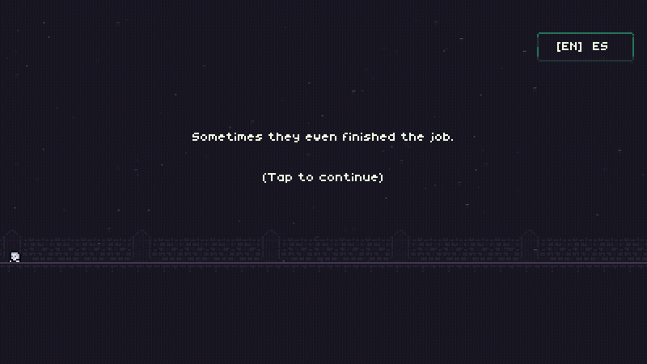
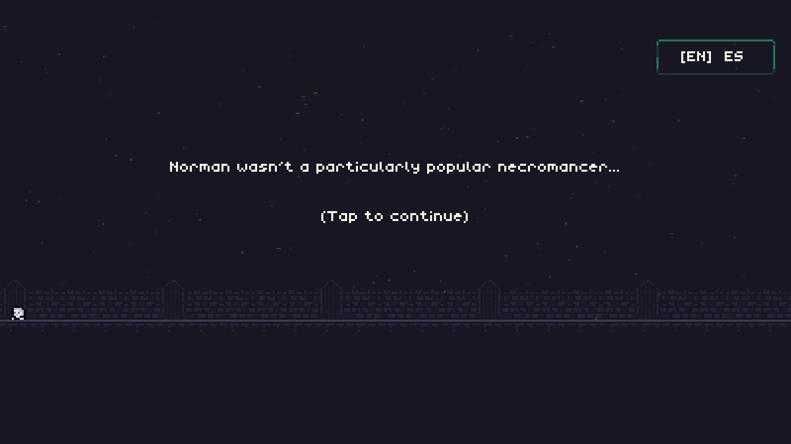
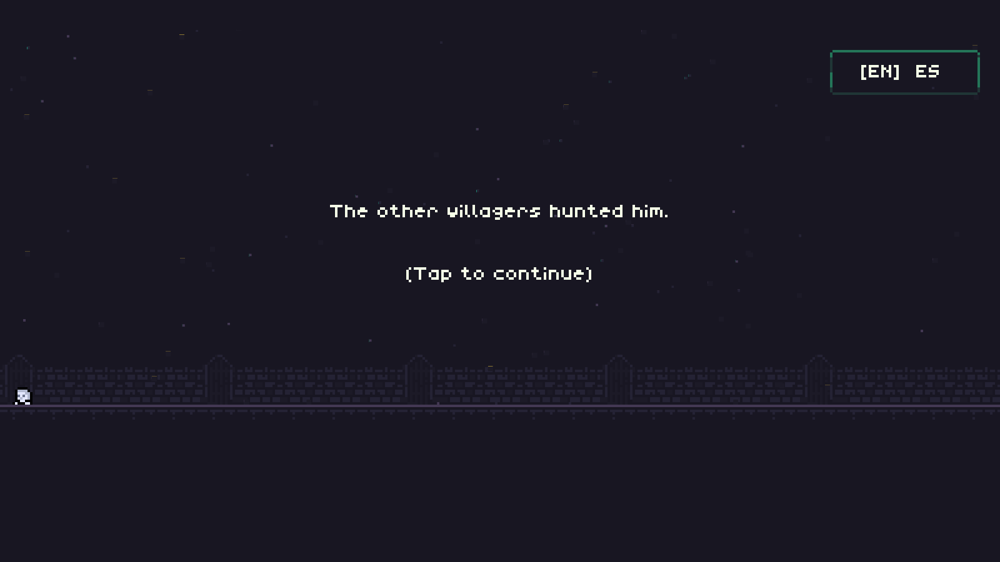
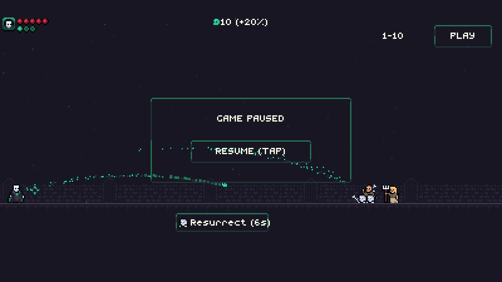
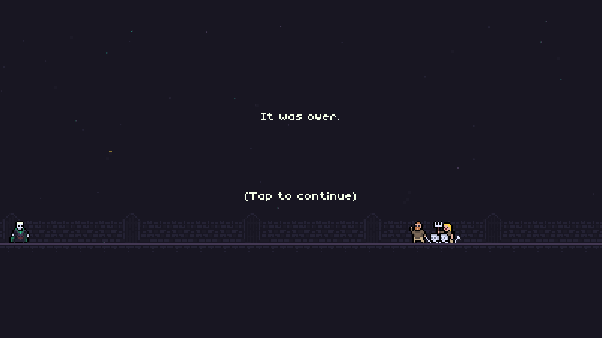

<h1 align="center">Norman The Necromancer 💀 🇨🇷</h1>

  
  
  
  
  

  
A 2D retro pixel-art roguelike action game where defeat is just the beginning.
 
Play as Norman, battle waves of angry villagers, and raise your fallen foes into an unstoppable skeleton army!

  

---

## 📸 Screenshots & Highlights

| 📖 Story & Intro | ⚔️ Active Combat |
|:---:|:---:|
|  |  |

| ⏸️ Pause & Touch Controls | 🏆 Victory & Credits |
|:---:|:---:|
|  |  |

---

## 📜 The Story

> *"Norman wasn't a particularly popular necromancer...*  
> *The other villagers hunted him.*  
> *Sometimes they even finished the job.*  
> *But like any self-respecting necromancer...*  
> *Norman just brought himself back."*

---

## 🎮 How to Play

- **Cast Arcane Spells**: Aim your trajectory and cast spells to eliminate incoming waves of angry villagers, nimble archers, and hostile monks.
- **Resurrect Your Allies**: When enemies fall, use your necromantic powers to bring their bones back as loyal skeleton warriors fighting on your side.
- **Visit the Rituals Shop**: Spend harvested souls between waves to unlock over **20 unique rituals** (*Bouncing spells, Doubleshot, Chain Lightning, Rain, Giants, Bleed, Frost*) and upgrade your maximum vitality and spell charges.
- **Survive The 10 Waves**: Battle through increasingly relentless hordes until you face **The King** in an epic multi-phase showdown.
- **Bilingual Experience**: Switch seamlessly between **English** and **Spanish** (`[EN] / ES`) right from the intro screen.

---

## 🕹️ Controls

| Action | 📱 Mobile & Touch | 💻 Desktop (Keyboard & Mouse) |
|---|---|---|
| **Aim & Cast** | Drag on screen to aim, release to shoot | Move cursor to aim, Left Click to shoot |
| **Resurrect** | Tap the on-screen **Resurrect** button | Press **Space** or **Enter** |
| **Pause / Resume** | Tap top-right **PAUSE** button | Press **P** or **Escape** |
| **Advance Dialogue** | Tap anywhere on screen | Press **Space** or **Enter** |
| **Language Toggle** | Tap **[EN] / ES** button on intro | Press **L** |
| **Shop Navigation** | Tap directly on any item or buy button | Arrow Keys (**Up / Down**) & **Enter** |

---

## 📱 Available Platforms

- 🤖 **Android**: Native app with touch-tailored controls and home indicator spacing.
- 🍏 **iOS**: Native SwiftUI/Compose framework for iPhone and iPad.
- 🖥️ **Desktop**: Native standalone executable for macOS, Windows, and Linux (JVM).
- 🌐 **Web**: Instant browser gameplay compiled with Kotlin/WasmJS and JavaScript.

---

## 🛠️ For Developers & Technical Documentation

All source code, Gradle modules (`:androidApp`, `:desktopApp`, `:iosApp`, `:shared`, `:webApp`), architecture patterns, and build tasks are organized inside the [`app/`](./app) directory:

👉 **[Read the complete Technical & Architecture Documentation in `app/README.md`](./app/README.md)**

---

## 👏 Credits & Attribution

- **Original Game Concept, Art & Audio**: [Dan Prince](https://danthedev.com/) — Created for [JS13k Games 2022](https://js13kgames.com/entries/norman-the-necromancer).
- **Kotlin Multiplatform Port & Touch Optimizations**: [KevinAH](https://github.com/kevinah95).
- **Engine**: [KorGE Game Engine](https://korlibs.so/) & [Compose Multiplatform](https://github.com/JetBrains/compose-multiplatform).

  Made with ❤️ in Costa Rica 🇨🇷

